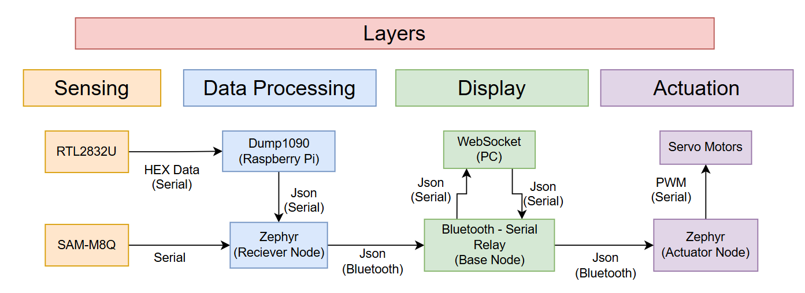
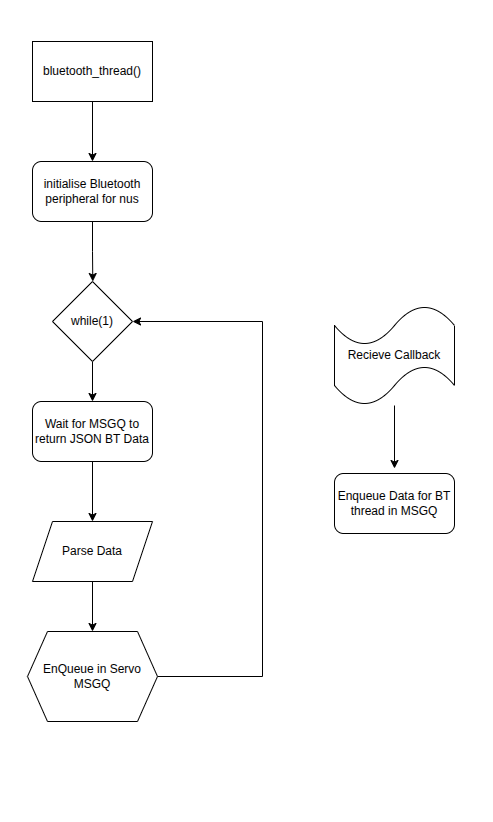
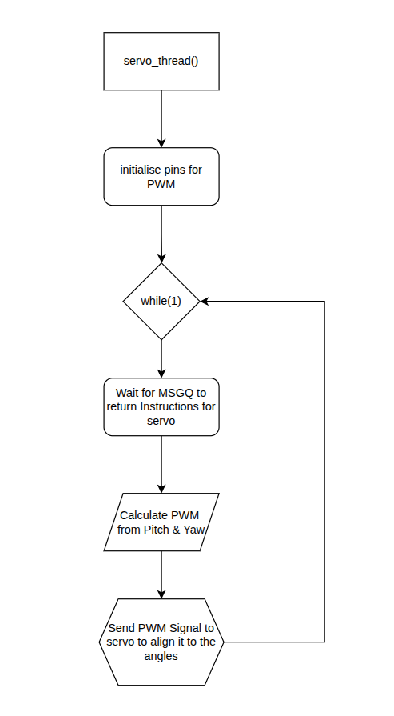
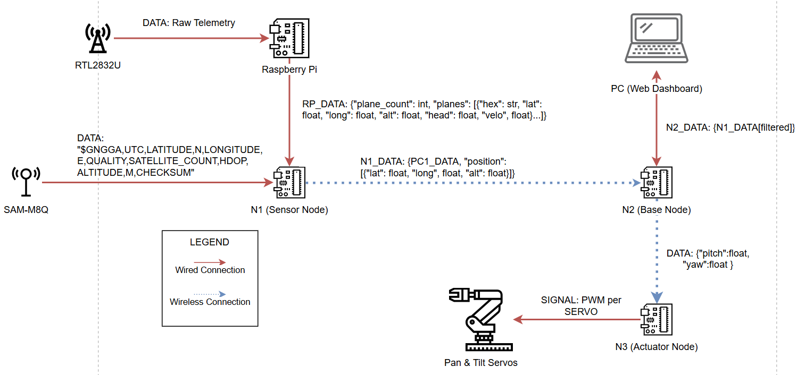
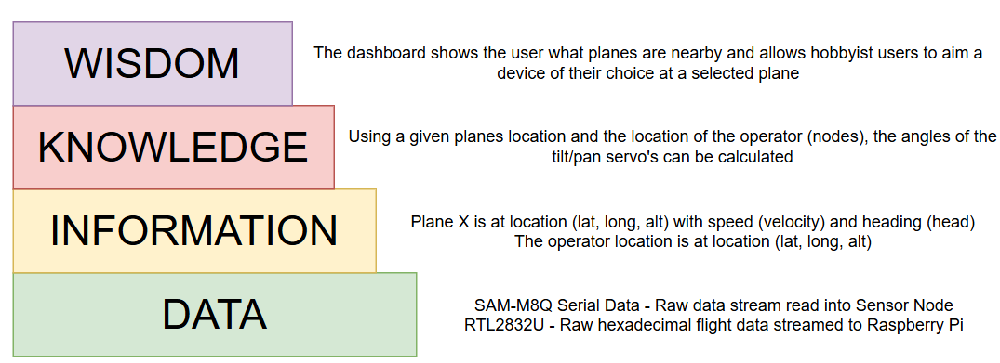
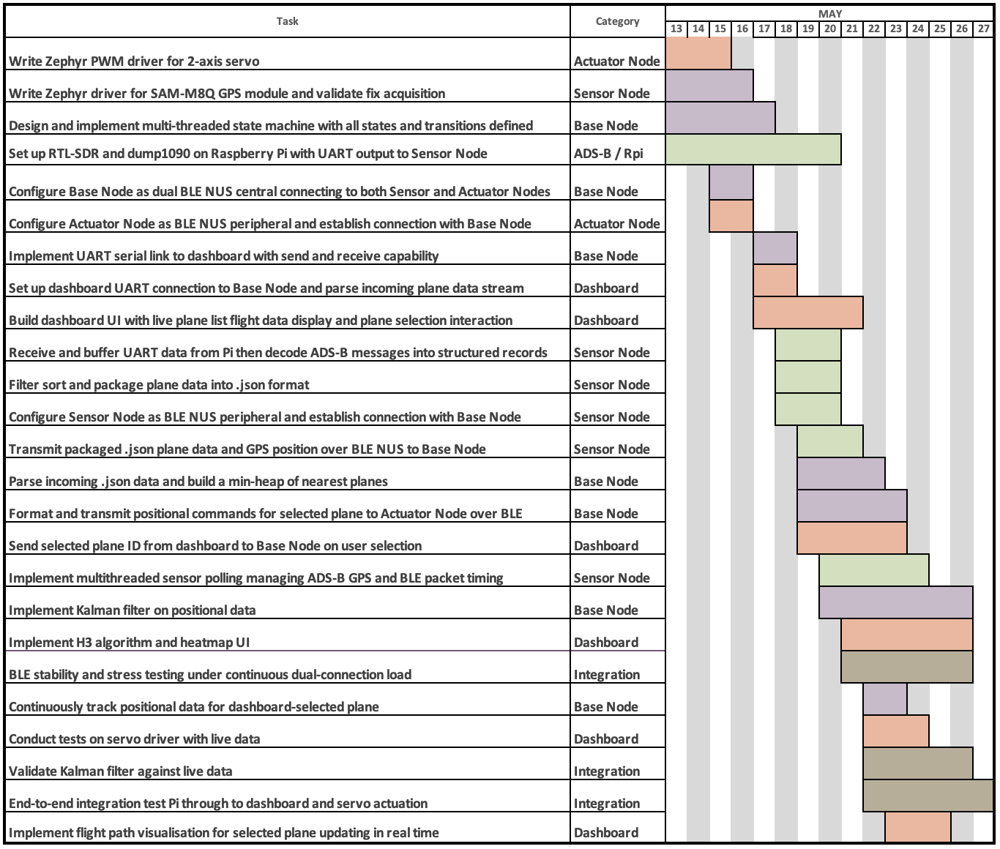
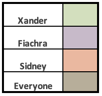

# Wheat Weywot | Tracking Aircraft for a Sustainable future for Brisbane

## Project Overview

### The Problem

Brisbane is among the fastest growing populations in the world with a current population of approximately 2.5 million people and counting.
#### 2032 Olympic Games
Additionally with the upcoming 2032 Olympic games the city's population is going to grow exponentially.

### Why is this important?

More people means more housing, more planes overhead and more noise. Accompanying this, the more people consequently means the more urban areas are stretched into industrial areas or outer city areas. Creating a domino effect of the following:

- Longer Travel
- Busier Roads
- Houses in high noise areas

Exposing people to the risks of louder neighbourhoods, resulting CO2 emissions, more noise pollution (industrial noise, roads, etc), Reduced Sleep and more.

#### We Believe Brisbane deserves better.

While we know we can’t in this project stop the development of houses and urbanization of industrial areas. We believe every single bit of info goes a long way which is why we have produced the solution which can help Brisbanites and hobbiests alike create informed decisions on their housing and travel like never before.

### The Solution

The proposed solution aims to repurpose well paved data for a change.

Utilising the RTL2832U transponder to extract precise coordinates of Aircraft we aim to utilise our own dataset and compare with preexisting data to create a accessible and interactive interface built with every Brisbanite in mind.

More Technically speaking to achieve this - we will have 3 Bluetooth nodes, 2 PC's, a Pan and Tilt Servo, RTL2832U transponder and a SAM-M8Q GPS Locator node.

The Pan and Tilt servo will be utilised to show how just about any person wishing to utilise the open source tool is able to easily interface and utilise the data.

We aim to make the project as transperant as possible aiming at both the hobbiests and Brisbanites who want to be informed about our great city.

#### But How Does This Link to Noise Pollution?

Recent Surveys suggest 70% of people living in areas under a flight path report that they have been affected on a daily basis by aircraft flying overhead to some extent.

Showing that having a highly reliable plane tracking and data aquisition tool would be game changing not only for Brisbanites but for the public health as a whole.

## Team Member List and Roles

### Xander

#### Sensors + Data Handling (Sensor Node)

Xander will focus on embedded code for the Sensor Node, as well as python code for the Raspberry Pi sensor controller. This will require establishing a BLE peripheral connection with the Base Node, and formation of data packets containing both plane and gps telemetry. The Raspberry Pi will be set up as a sensor controller for the RTL2832U, piping incoming data to the node over UART serial. Data will be decoded, filtered, sorted and packaged to .json. A zephyr driver for the gps module will be utilised, and gps data will be sent to the Base Node when required. The Node will have to handle package BLE timing, alongside sensor polling for both sensors.

### Fiachra

#### Core Intelligence + Control (Base Node)

Fiachra will focus on writing embedded code for the Base Node, as well as an initial zephyr driver for the gps module. Firstly, a zephyr driver will be created for the SAM-M8Q GPS module. Then for the Base Node, two BLE NUS central connections will be established to work with peripheral connections at the Actuator Node, and Sensor Node respectively. The Base Node must also parse incoming .json data, and format it as a min-heap. The Base Node will have to run a Kalman Filter on the incoming data, and compute nearest calculations such as relative position. It should also be able to continuously track positional data for a chosen plane (dashboard). Fiachra will also develop a UART serial communication with the dashboard, with ability to send data to, and receive data/requests from the dashboard. Finally, the chosen plane (dashboard) position should be communicated to the Actuator Node. The Base Node must also maintain a multi-threaded state machine and manage memory throughout.

### Sidney

#### Dashboard + Actuation + Integration

Sidney will handle dashboard design, and integration as well as embedded code for the Actuator Node. This will involve creating a Zephyr driver for the 2-axis servo at the Actuator Node, utilising PWM. Sidney will introduce a BLE NUS peripheral connection to receive positional commands from the Base Node. He will also have to develop the web dashboard UI to display current planes and plane data and allow for user selection of visible planes. It should also be able to visualise the continuous flight path of the chosen plane, and send the selected plane ID to the Base Node.

## Deliverables & Key Performance Indicators

### 1. Dashboard Data Vision

The web dashboard should be able to plot aircraft and user (Base Node) position, with no loss of data as received from the base. It should be able to plot at least 30 planes at once, and store 60 seconds of plane data for each plane.

### 2. Dashboard to Actuator Communication

User should be able to select and toggle to a plane on the dashboard and have the servo reflect the planes position within a 3 second window.

### 3. Actuator Accuracy

The servo be able to update position to point at the chosen plane no less then once per second, to within 15 degrees of precision.

### 4. Min-Heap

The Base Node should store data for 30 planes as received from the Sensor Node in a min-heap.

### 5. System runtime & Memory Management

Memory will be dynamically managed across the 3 nodes, such that the system can run for at least 10 minutes with no issues.

### 6: Maintain Good Code Style and Coding Practices

Code will reflect the Google C++ Style Guide and code will be sufficiently commented.

## System Overview

The system is made up of three zephyr nodes,a Raspberry Pi node, and a PC

- **PC**:  The PC will manage the data incoming from the base node and utilise a backend and frontend for the web interface. The Backend will be scripted in Python and HTTP requests will be handled via FastAPI to the frontend. The frontend will be implemented using the React javascript framework to keep the inteface sleek and user friendly the HTTP requests will be handled using Axios.
- **Raspberry Pi**: A lightweight data scraper that will take information from the RTL2832U and pass it on to the Sensor Node, a Raspberry pi was selected as it is able to run Dump1090
- **Sensor Node**: Receives the sensor data from the SAM-M8Q and the transmitted sensor data from a Raspberry Pi connected to the RTL2832U
- **Base Node**: This node will perform most of the computation and acts as a relay from the Sensor Node to the web interface on the PC. The Base Node will also send commands to the servo motors through the Actuator Node
- **Actuator Node**: This node will have a PWM actuator driver installed and will operate the pan & tilt servos based on position commands from the Base Node

### Block Diagram

#### Actuator Node Threads

| ##### Bluetooth Thread |  |
| ##### Servo Thread | |

## Sensor Integration

### RTL2832U

The RTL23832U has encoded data packets streamed over serial through a USB port, this data will be extracted using Dump1090 which is a prebuilt software package. Dump1090 has a lot of inbuilt capabilities, however the functionality of interest is that it can post the data to a locally hosted website (http://<host>:8080/data/aircraft.json). This will make it easy to scrape json formatted plane data from the website using a python file calling http GET requests on the same port.

### SAM-M8Q

The SAM-M8Q will be connected via serial (RX and TX) pins, the serial output from the SAM-M8Q is straight forward. The format for which is specified in the wireless network communications section below. A simple UART based driver will register callback functions on the UART receive line and store each line of gps data into a buffer on the Sensor Node.

## Wireless Network Communications

### Raspberry Pi

The Raspberry Pi is responsible for receiving the information from the RTL2832U transponder using Dump1090, once processed, the relevant plane information will be sent via serial in a json format to the zephyr based Sensor Node. The json format will be the following.

    {
    "plane_count": int,
    "planes": [
        {
        "hex": str,
        "lat": float,
        "long": float,
        "head": float,
        "velo": float
        },
        ...
    ]}

### Sensor Node

The Sensor Node is responsible for the following:

- Reading GPS data from the SAM-M8Q (via UART pins)
- Receiving plane data from the Raspberry Pi (via USB-C) // Also power
- Sending new json packet with both sets of data

The SAM-M8Q continuously sends GPS data over UART in the form

    $GNGGA,UTC,LATITUDE,N,LONGITUDE,E,QUALITY,SATELLITE_COUNT,HDOP,ALTITUDE,M,CHECKSUM

a polling function will read the current value and package the data with the plane data from the Raspberry Pi.

The packaged packet will be transmitted via BLE to the Base Node, this will use BLE NUS to communicate with the other zephyr based xiao board. The packet will be formatted in json with the following format.

    { "plane_count": int,
    "planes": [
    {"hex": str, "lat": float,
    "long": float, "head": float,
    "velo": float},
    ...
    ], "position": [
    {"lat": float, "long",
    float, "alt": float }]}

### Base Node

The Base Node is responsible for the following:

- Receiving telemetry data from Sensor Node
- Filtering for closest planes and passing data to the PC for display on the web dashboard
- Calculating the required servo positions and communicating to the Actuator Node

The communication to the Actuator Node will be via BLE NUS communication where it will send json encoded pitch and yaw values.

    {"pitch": float, "yaw": float}

### Actuator Node

The Actuator Node receives the required pitch and yaw values from the Base Node and moves the servos using PWM signals connected to GPIO pins.

### Message Protocol Diagram

## Algorithms

### Base Node

- Min-heap - For storing 30 closest planes and details
- Kalman Filter - For smoothing out location data

### Web Interface

- Uber's H3 algorithm - Heat mapping on the interface for mapping hot spots for planes

## DIKW Pyramid Abstraction

## Project Software/Hardware management

## Zephyr RTOS Advanced Libraries and Kernel Features

| Library | Description | Nodes Utilised |
| ----------- | ----------- | ----------- |
| `<zephyr/sys/min_heap.h>` | For storing closest 30 plane data. | Base Node |
| `<zephyr/bluetooth/services/nus.h>` | For communication between nodes. | All Nodes |
| `<zephyr/bluetooth/bluetooth.h>` | To support communications between nodes. | All Nodes |
| `<zephyr/drivers/pwm.h>` | To drive the servo motor. | Actuator Node |
| `<zephyr/sys/json.h>` | For communicating via serial between nodes. | Base Node and Sensor Node |
| `<zephyr/shell/shell.h>` | To help with communication between nodes and driving shell commands. | Base Node |
| `<zephyr/drivers/uart.h>` | For driving communication between the Sensor Node and SAM-M8Q GPS. | Sensor Node |
# Equipment

- RTL2832U - Radio transponder
- SAM-M8Q - GPS Receiver
- Xiao BLE Sense board \* 3
- Pan & Tilt Servo
- Raspberry Pi
- Laptop/PC
- Assorted male/male wires
- Assorted USB - USB-C cables
